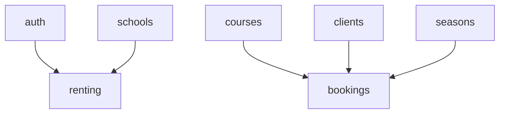

# Modules Catalog

This document lists the application modules and their relationships.

## Modules

| Slug | Name | Priority | Dependencies |
| ---- | ---- | -------- | ------------ |
| auth | Authentication | core | - |
| schools | Schools | core | - |
| seasons | Seasons | core | - |
| users_roles | Users & Roles | core | - |
| feature_flags | Feature Flags | core | - |
| courses | Courses | high | - |
| clients | Clients | high | - |
| bookings | Bookings | high | courses, clients, seasons |
| renting | Renting | high | schools, auth |
| instructors | Instructors | medium | - |
| schedules | Schedules | medium | - |
| vouchers | Vouchers | medium | - |
| finance | Finance | low | - |
| analytics | Analytics | low | - |
| comms | Communications | low | - |

## Dependency Diagram

